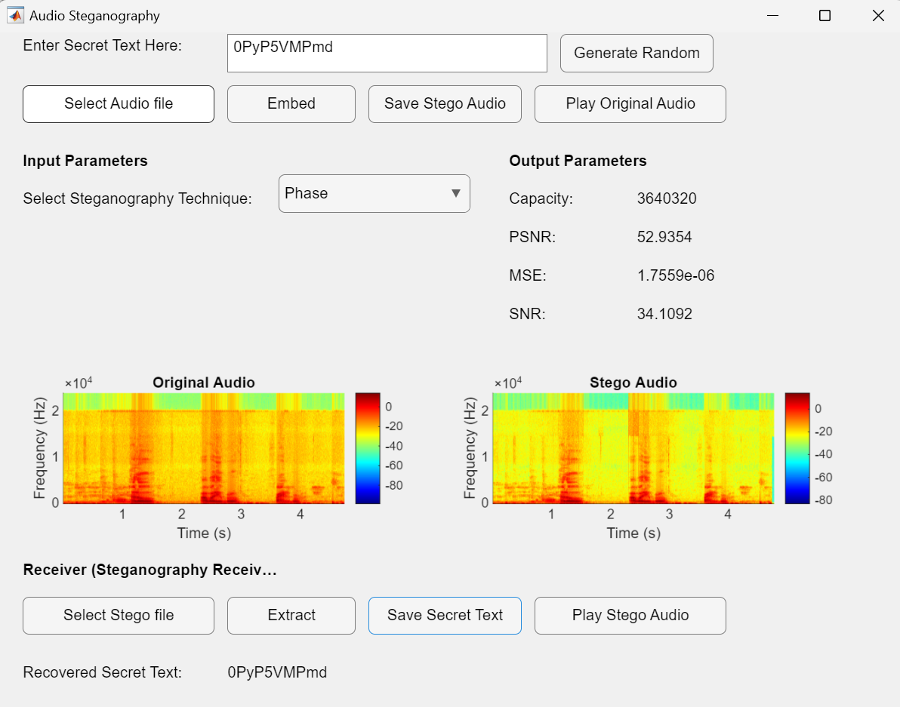

# 🎶 Audio Steganography Project in MATLAB 🎶

### Welcome to the Audio Steganography Project! 🌐

This project explores four different audio steganography techniques, each with its own unique approach to hiding messages within audio files. Dive in and experiment with **Spread Spectrum**, **LSB Substitution**, **Phase Coding**, and **Echo Hiding**. All techniques are available in this project to provide a comprehensive understanding of audio data embedding!

---

## 📋 Features

- **Spread Spectrum**: Uses frequency spreading to conceal data, ensuring robustness in noisy environments.
- **LSB Substitution**: Embeds information in the least significant bits for efficient, low-impact data hiding.
- **Phase Coding**: Alters phase components to hide information securely.
- **Echo Hiding**: Creates slight echoes that carry hidden messages, providing a subtle steganographic technique.

## 🚀 Getting Started

1. **Clone this repository** to your local machine.
2. Open **MATLAB**.
3. Run the `gui.m` file to start the graphical user interface (GUI).
4. Explore and experiment with the four steganography techniques!

---

## 🎮 Usage Instructions

- **Step 1**: Launch the GUI by executing `gui.m`.
- **Step 2**: Choose one of the four techniques from the interface.
- **Step 3**: Load your audio file and enter the secret message.
- **Step 4**: Hit **Encode** to embed your message or **Decode** to retrieve hidden messages.

### 📸 Screenshot

- **GUI Interface**: *"The central hub for exploring each steganography technique in one easy-to-use interface"*


```markdown

